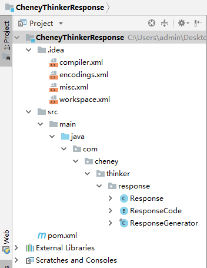

##
API 响应结果封装描述文档

####author: CheneyThinker
####phone: 13265623422（ 18380804865 ）
####email: clxuanye@163.com （ yizhikouyi@163.com ）
####qq: 1113934812
####wechat: yizhi\_kouyi\_yuhong
## ##

## ##
- ##定义##
	- **Response （响应实体）** 
	- **ResponseCode （响应码枚举，参考HTTP状态码的语义<a href="https://tools.ietf.org/html/rfc2616" target="_blank">RFC2616</a>）**
	- **ResponseGenerator （响应结果生成器）**
 ## ##
- ##环境要求##
	- **SpringBoot：2.0.1.RELEASE**
	- **JDK：1.8** 
 ## ##
- ##功能总述##
	- **API 响应结果封装，对外暴露四个常用结果集**
		- **执行事项成功未带数据 genOk()**
		- **执行事项成功带数据 genOk(data)**
		- **执行事项失败未带数据 genBadRequest(logger, e, defaultMsg)**
		- **执行事项失败带数据 genBadRequest(logger, data, e, defaultMsg)**
##
- <a href="https://github.com/CheneyThinker" target="_blank">CheneyThinker</a>
	- <a href="https://github.com/CheneyThinker/CheneyThinkerResponse" target="_blank">CheneyThinkerResponse</a>
		- <a href="https://github.com/CheneyThinker/CheneyThinkerResponse/blob/master/src/main/java/com/cheney/thinker/response/Response.java" target="_blank">Response</a>
		- <a href="https://github.com/CheneyThinker/CheneyThinkerResponse/blob/master/src/main/java/com/cheney/thinker/response/ResponseCode.java" target="_blank">ResponseCode</a>
		- <a href="https://github.com/CheneyThinker/CheneyThinkerResponse/blob/master/src/main/java/com/cheney/thinker/response/ResponseGenerator.java" target="_blank">ResponseGenerator</a>
##
## API 响应结果封装
###工程结构:
## ##

## ##
###代码明细：
## ##
	package com.cheney.thinker.response;

	import com.fasterxml.jackson.annotation.JsonInclude;

	/**
 	 * @description 响应实体
 	 * @author CheneyThinker
 	 * @date 2018-06-14
 	 */
	@JsonInclude(JsonInclude.Include.NON_EMPTY)
	public class Response {

    	private Integer code;
    	private String msg;
    	private Object data;

	    public Integer getCode() {
	        return code;
	    }
	
	    public Response setCode(ResponseCode code) {
	        this.code = code.getCode();
	        return this;
	    }
	
	    public String getMsg() {
	        return msg;
	    }
	
	    public Response setMsg(String msg) {
	        this.msg = msg;
	        return this;
	    }
	
	    public Object getData() {
	        return data;
	    }
	
	    public Response setData(Object data) {
	        this.data = data;
	        return this;
	    }

	}
## ##
	package com.cheney.thinker.response;
	
	/**
	 * Status Code Definitions
	 *  Informational 1xx
	 *  Successful 2xx
	 *  Redirection 3xx
	 *  Client Error 4xx
	 *  Server Error 5xx
	 *  https://tools.ietf.org/html/rfc2616
	 * @description 响应码枚举，参考HTTP状态码的语义
	 * @author CheneyThinker
	 * @date 2018-06-14
	 */
	public enum ResponseCode {
	
	    CONTINUE(100),//Continue
	    SWITCHING_PROTOCOLS(101),//Switching Protocols
	
	    OK(200),//OK
	    CREATED(201),//Created
	    ACCEPTED(202),//Accepted
	    NON_AUTHORITATIVE_INFORMATION(203),//Non-Authoritative Information
	    NO_CONTENT(204),//No Content
	    RESET_CONTENT(205),//Reset Content
	    PARTIAL_CONTENT(206),//Partial Content
	
	    MULTIPLE_CHOICES(300),//Multiple Choices
	    MOVED_PERMANENTLY(301),//Moved Permanently
	    FOUND(302),//Found
	    SEE_OTHER(303),//See Other
	    NOT_MODIFIED(304),//Not Modified
	    USE_PROXY(305),//Use Proxy
	    UNUSED(306),//Unused
	    TEMPORARY_REDIRECT(307),//Temporary Redirect
	
	    BAD_REQUEST(400),//Bad Request
	    UNAUTHORIZED(401),//Unauthorized
	    PAYMENT_REQUIRED(402),//Payment Required
	    FORBIDDEN(403),//Forbidden
	    NOT_FOUND(404),//Not Found
	    METHOD_NOT_ALLOWED(405),//Method Not Allowed
	    NOT_ACCEPTABLE(406),//Not Acceptable
	    PROXY_AUTHENTICATION_REQUIRED(407),//Proxy Authentication Required
	    REQUEST_TIMEOUT(408),//Request Timeout
	    CONFLICT(409),//Conflict
	    GONE(410),//Gone
	    LENGTH_REQUIRED(411),//Length Required
	    PRECONDITION_FAILED(412),//Precondition Failed
	    REQUEST_ENTITY_TOO_LARGE(413),//Request Entity Too Large
	    REQUEST_URI_TOO_LONG(414),//Request-URI Too Long
	    UNSUPPORTED_MEDIA_TYPE(415),//Unsupported Media Type
	    REQUESTED_RANGE_NOT_SATISFIABLE(416),//Requested Range Not Satisfiable
	    EXPECTATION_FAILED(417),//Expectation Failed
	
	    INTERNAL_SERVER_ERROR(500),//Internal Server Error
	    NOT_IMPLEMENTED(501),//Not Implemented
	    BAD_GATEWAY(502),//Bad Gateway
	    SERVICE_UNAVAILABLE(503),//Service Unavailable
	    GATEWAY_TIMEOUT(504),//Gateway Timeout
	    HTTP_VERSION_NOT_SUPPORTED(505);//HTTP Version Not Supported
	
	    private final Integer code;
	
	    ResponseCode(final Integer code) {
	        this.code = code;
	    }
	
	    public Integer getCode() {
	        return code;
	    }
	
	}
## ##
	package com.cheney.thinker.response;
	
	import org.slf4j.Logger;
	import org.springframework.util.StringUtils;
	
	/**
	 * @description 响应结果生成器
	 * @author CheneyThinker
	 * @date 2018-06-14
	 */
	public final class ResponseGenerator {
	
	    private static final String DEFAULT_OK = "OK";
	    private static final String format = "\nclass:\t{}\nmethod:\t{}\nline:\t{}\n";
	
	    public static Response genOk() {
	        return new Response()
	                .setCode(ResponseCode.OK)
	                .setMsg(DEFAULT_OK);
	    }
	
	    public static Response genOk(Object data) {
	        return genOk()
	                .setData(data);
	    }
	
	    public static Response genBadRequest(Logger logger, Exception e, String defaultMsg) {
	        StackTraceElement[] elements = e.getStackTrace();
	        for (int i = elements.length - 1; i >= 0; i--) {
	            StackTraceElement element = elements[i];
	            logger.error(format, element.getClassName(), element.getMethodName(), element.getLineNumber());
	        }
	        return new Response()
	                .setCode(ResponseCode.BAD_REQUEST)
	                .setMsg(StringUtils.isEmpty(e.getMessage()) ? defaultMsg : e.getMessage());
	    }
	
	    public static Response genBadRequest(Logger logger, Object data, Exception e, String defaultMsg) {
	        return genBadRequest(logger, e, defaultMsg)
	                .setData(data);
	    }
	
	}
## ##

	备注：
		download command: git clone https://github.com/CheneyThinker/CheneyThinkerResponse.git